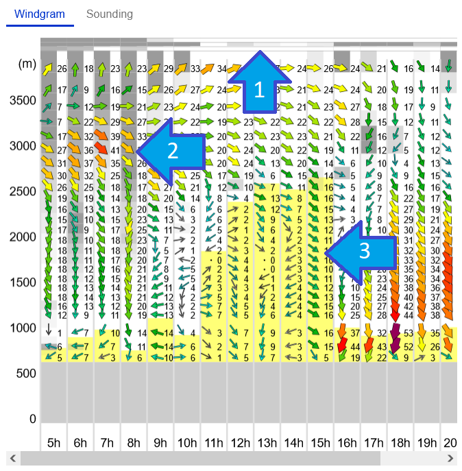
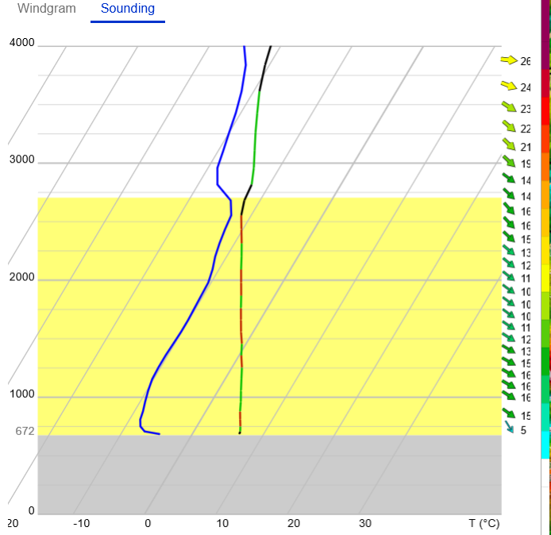

# The diagram views

Here you find a description of the different diagram types available
on the left side of the main window.

Use the selector on the top of the diagram to choose which view to
show. There is "Windgram" and "Sounding" available.

## Windgram

The windgram shows the direction and strength of the wind for the
whole day in different alitudes.

The Y axis shows the altitude in MSL (main sea level) in meter. The X
axis is the time of the selected day.

The grey block at the bottom is the ground level. In this case, it is
at 600m MSL.

Above that you see the wind arrows showing the direction of the wind
at the time and altitude. The strength of the wind is shown as a color
and boldness of the arrow.

The yellow background (blue arrow "3") shows the ?

The grey background in the sky (e.g. at 8am above 2000m) are clouds
(blue array "2"). The darker the grey is, the more density have the
clouds.

And at the top you find three small lines with grey boxes in it (blue
arrow "1"). They show the density of the clouds in the lower
(GND-1000m), middle (1000m-2000m) and higher parts (3000m and above)
of the sky.

## Sounding

The sounding diagram shows the temperature of the air at the selected
time and location.

There is a detailed explanation in [this page](emagran.md).

