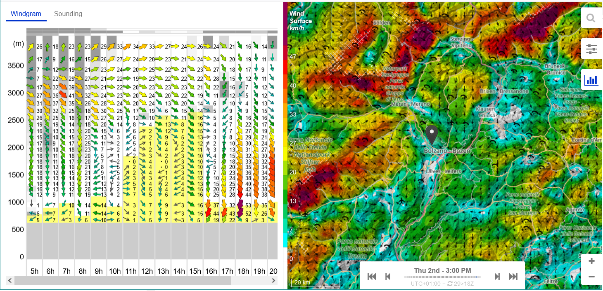
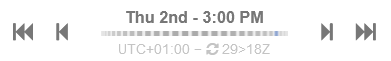

This is the main documentation for using http://meteo-parapente.com

The main application window is split into two parts. On the left side
you find a diagramm and the right side shows a map. The map also
contains the date/time selector to select the wanted forecast time.

## The time selector

Use this selector to decide what time should be shown in all of the
visible views.

The dotted line below the date and time corresponds to the visible
daylight of the selected day. In this example we show "3pm" which is a
small blue dot on the right end of the line. This means, that 3pm is
nearly at the end of the available daylight.

Help needed: What does "29>18Z" mean?

Please keep in mind, that only the paid version shows every day. The
free version takes out 2 days of the week. See [Join the
club](../users/contribute/) for more info on this.

## The map

The map can be moved around, zoomed in and out, like any standard
map. It is showing a specific aspect (e.g. wind at the ground level),
that can be selected in the settings menu. Open this menu by using the
 settings icon. Here you
will find an explanation of every available [map views](map-views.md).

Use the diagram  to
toggle the appearance of the diagram view on the left side of the
window.

And use the search icon to enter the name of a city, that the map
should show.

You can set a marker on this map by clicking any point on the map.

## The diagram

The diagram on the left side of the screen always refers to the
selected point of the map and will give you detailled information for
this location.

There are multiple views on the diagram side, which you can
select. Please read [diagram views](diagram-views.md) for a detailed
explanation of the available diagram views.

## Weather Examples

After you are familiar with the usage of meteo-parapente, you can
study the given [examples](weather-examples.md) to get a better understanding. They
will show you different views and weather situations and explain, what
you can see.

## Use Cases

The last step is showing you various [use cases](use-cases.md) of a
typical usage of meteo-parapente. They will explain how you can use
the program to solve specific tasks, like "where should I go on
weekend to fly?".

 